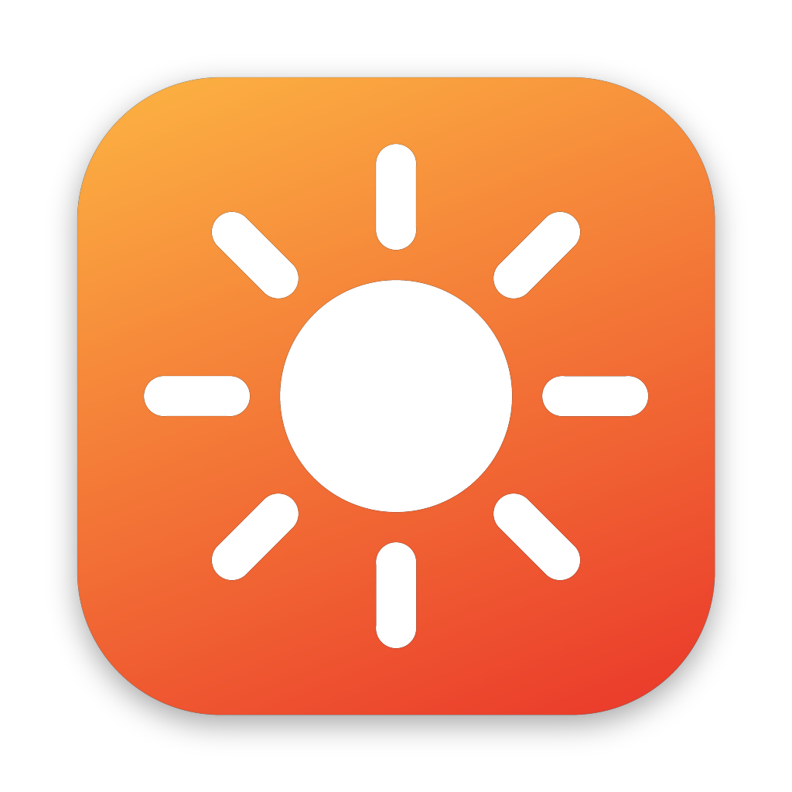

<p align="center"></p>

<h1 align="center">Based</h1>
<p align="center">Turn your screen red. Lives in the menu bar. That's it.</p>

## Modes

| | |
|---|---|
| ☀️ **Day** | Yellow tint. Blue cut, still usable. |
| 🌙 **Night** | Fully red. |
| ⊘ **Off** | Normal colours. |

Plus an **Open at login** switch.

## Install

1. Grab **Based.dmg** from [Releases](../../releases/latest).
2. Open it, drag **Based** into **Applications**.
3. First launch only: right-click Based → **Open**. If macOS still blocks it: System Settings → Privacy & Security → **Open Anyway**.

## If the colour doesn't change

macOS 26 blocks screen colour changes while **Automatically adjust brightness** is on. Turn it off in System Settings → Displays. Turn off Night Shift and True Tone too.

## Build it yourself

```sh
./scripts/build.sh
open dist/Based.app
```

Every push to `main` builds a new release automatically via GitHub Actions.

## Signing & notarization (removes the "Apple could not verify" warning)

Needs an [Apple Developer Program](https://developer.apple.com/programs/) membership. Add these as repo secrets (Settings → Secrets and variables → Actions):

| Secret | What |
|---|---|
| `MACOS_CERT_P12` | Your **Developer ID Application** certificate exported as .p12, base64'd: `base64 -i cert.p12 \| pbcopy` |
| `MACOS_CERT_PASSWORD` | The password you set when exporting the .p12 |
| `APPLE_ID` | Your Apple ID email |
| `APPLE_TEAM_ID` | 10-character Team ID (developer.apple.com → Membership) |
| `APPLE_APP_PASSWORD` | App-specific password from [account.apple.com](https://account.apple.com) → Sign-In and Security |

Without them, builds are still made — just ad-hoc signed.
